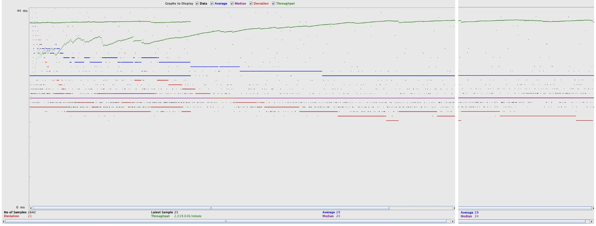
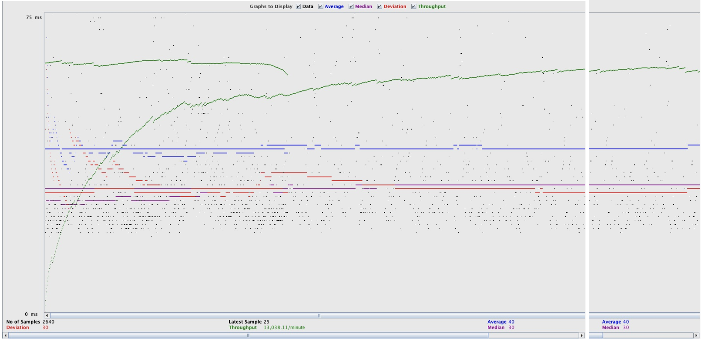
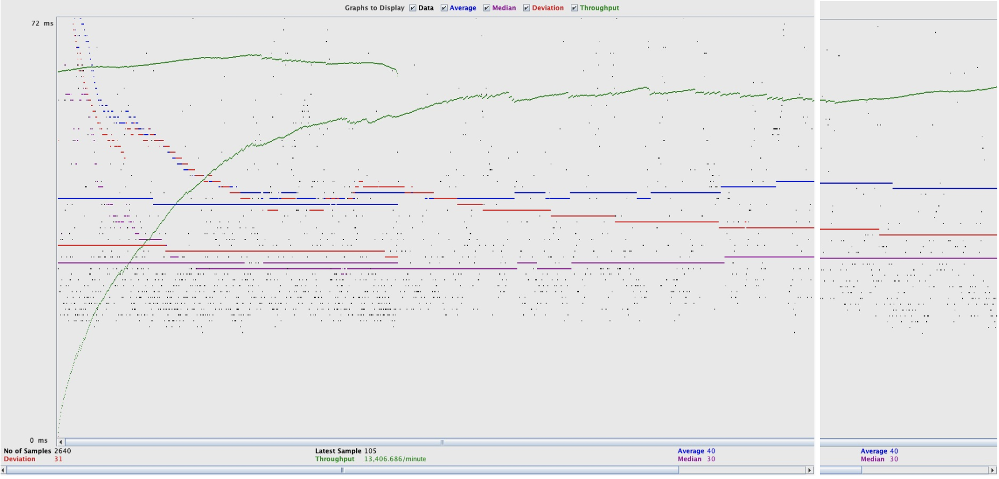
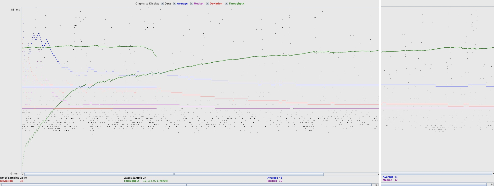
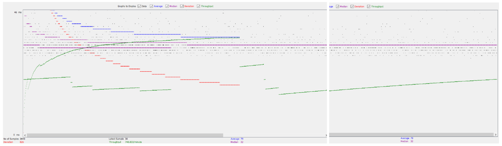
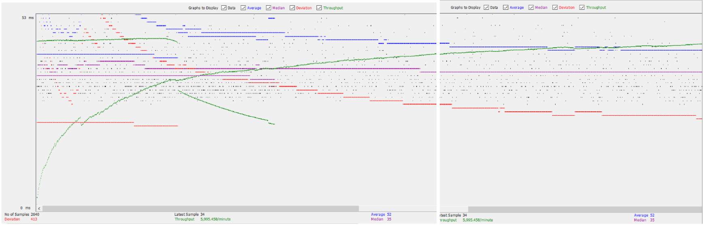
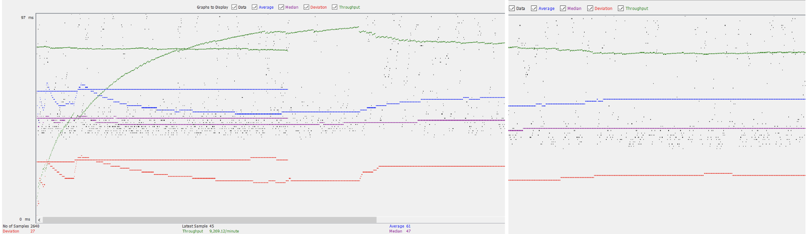

# General
  - #### Team: `the-party-parrots`
  - #### Names:
    - Colin Yee
    - Michelle Lin
  - #### Project 5 Video Demo Link:
    - Note: our demo is formatted weirdly format as the single instance is on michelle's aws and the load balancer + master/slave is on colin's so we first show the single instance the scaled versions
      - also michelle's jmeter doesn't work so colin is running jmeter against michelle's instance as well
    - https://www.youtube.com/watch?v=Zag2AkGfciY
      - [0:00](https://youtu.be/Zag2AkGfciY?si=zB2tHZlziuNKCfqJ) showing single instance on aws + login (michelle's laptop)
      - [0:20](https://youtu.be/Zag2AkGfciY?si=tKjcdZi5_5ofmto7&t=20) running JMeter for the _https_ single instance (colin's laptop)
      - [5:30](https://youtu.be/Zag2AkGfciY?si=tKjcdZi5_5ofmto7&t=330) Jmeter finish + get log file onto michelle's local computer
      - [7:50](https://youtu.be/Zag2AkGfciY?si=tKjcdZi5_5ofmto7&t=470) run the time parsing for single instance (michelle's laptop)
      - [8:30](https://youtu.be/Zag2AkGfciY?si=tKjcdZi5_5ofmto7&t=510) showing the load balancer, master, slave on aws (colin's computer)
      - [9:10](https://youtu.be/Zag2AkGfciY?si=tKjcdZi5_5ofmto7&t=550) run jmeter test on scaled instance
      - [14:50](https://youtu.be/Zag2AkGfciY?si=tKjcdZi5_5ofmto7&t=890) test finishes + show time log + get file on local machine
      - [19:05](https://youtu.be/Zag2AkGfciY?si=tKjcdZi5_5ofmto7&t=1145) get time log files on michell's laptop + parse them
  - #### Collaborations and Work Distributions:
    - Servlets
      - MovieList (Colin, Michelle)
      - SingleMovie (Michelle)
      - SingleStar (Michelle)
      - Payment (Colin)
      - ShoppingCart (Michelle)
      - GenreServlet (Colin)
      - Jump (Michelle)
      - LoginFilter, Login (Michelle)
      - UpdateSecurePassword (Michelle)
      - BrowseGenre, BrowseTitle (Michelle)
      - RecaptchaConstraints, RecaptchaVerifyUtils (Michelle)
      - EmployeeLoginFilter, EmployeeLoginServlet (Michelle)
      - MovieSuggestion (Colin, Michelle)
    - Classes
      - Movie (Colin)
      - User (Michelle, Colin)
      - Employee (Michelle)
      - Actor (Michelle)
      - MovieObject (Colin)
      - StarInMovie (Michelle)
    - JS/HTML/CSS
      - `index` (Colin, Michelle)
      - `_dashboard` (Michelle)
      - `jump-movielist.js` (Michelle)
      - `login` (Michelle)
      - `movielist` (Michelle, Colin)
      - `payment` (Colin)
      - `navbar.css` (Michelle)
      - `shoppingcart` (Michelle, Colin)
      - `single-movie` (Michelle)
      - `single-star` (Michelle)
    - Parser
      - ActorParser (Michelle)
      - MovieParser (Colin)
      - CastParser2 (Michelle)
      - CastParser (Colin)
      - xmlParser (Colin, Michelle)
      - TimeLogParser (Michelle)
    - SQL Files
      - create_table.sql (Colin, Michelle)
      - full_text.sql (Michelle)
      - stored-procedure.sql (Michelle, Colin)
      - column_triggers.sql (Colin)
    - Files
      - .gitignore (Michelle)
      - pom.xml (Michelle)
      - context.xml (Michelle, Colin)
      - web.xml (Michelle, Colin)
    - Android
      - MovieListActivity, MovieListViewAdaptor, activity_movielist.xml (Colin)
      - SingleMovieListActivity, SingleMovieListViewAdaptor, activity_single_movie.xml, singlemovielist_row.xml (Colin)
      - urlConstants (Colin)
      - NukeSSLCerts, NetworkManager, LoginActivity, activity_login.xml (Michelle)
      - SearchActivity, activity_search.xml (Michelle)
      - AndroidManifest.xml (Michelle)
      - movielist_row.xml (Michelle, Colin)
    - Functionality
      - Add to Cart (Colin)
      - Proceed to Payment & Place Order (Colin)
      - Recaptcha (Colin)
      - HTTPS (Colin)
      - Parser Optimizations (Colin)
        - Batch Insertion
        - Multi-Threading
      - GET/POSTs (Michelle, Colin)
      - Advanced Jump Functionality (Michelle)
      - Search Autocomplete (Michelle)
      - Full Text Search (Colin)
      - Login In (Michelle)
      - Pagination, Sorting (Michelle)
    - Performance Tuning and Scaling
      - JDBC Connection Pooling (Colin)
      - Master-Slave Replication (Colin)
      - Load Balancer (Colin)
      - JMETER & Time Measurements (Michelle)

### Files that use PreparedStatements
- Almost all files in src (except User,Movie,MovieObject,Actor,RecaptchaConstraints,JumpServlet)
- most servlets already used prepared statements 
- changes: MovieListServlets (~line 135) changes to use PreparedStatements

### Parser Optimizations
1. Implemented Multi-Threading for MovieParser.
   - Use 3 threads to parse 3 batches of prepared statements at the same time. 
   - Reduced time of MovieParser to 1/3 its original time.
2. Implemented Batch Insertion in all Parsers.
   - Will create and execute prepared statements every 'x' objects. 
   - Reduced by time of all parsers to 1/(1.5) of their original times.
3. Implemented HashMap on CastParserV2.
   - Stores movies created in MovieParser in hashmap to be referenced by CastParser instead of calling db multiple times.
   - Reduces time of CastParserV2 by 1/2 its original time.
  
### Inconsistency Report
- located in movieLogs.txt, castLogs.txt, and actorLogs.txt in the /parseLogs/ file.

# Connection Pooling
  - #### Include the filename/path of all code/configuration files in GitHub of using JDBC Connection Pooling.
      * `\src\Browse\BrowseGenreServlet.java`
      * `\src\Browse\BrowseTitleServlet.java`
      * `\src\Browse\GenreServlet.java`
      * `\src\Employee\UpdateSecurePassword.java`
      * `\src\Login\UpdateSecurePassword.java`
      * `\src\Employee\DashboardServlet.java`
      * `\src\Employee\EmployeeLoginServlet.java`
      * `\src\Login\LoginServlet.java`
      * `\src\Parse\ActorParser.java`
      * `\src\Parse\CastParser2.java`
      * `\src\Parse\MovieParser.java`
      * `\src\Search\MovieSuggestion.java`
      * `\src\ShoppingCart\PaymentServlet.java`
      * `\src\ShoppingCart\ShoppingCartServlet.java`
      * `\src\WebPages\MovieListServlet.java`
      * `\src\WebPages\SingleMovieServlet.java`
      * `\src\WebPages\SingleStarServlet.java`
      - #### Explain how Connection Pooling is utilized in the Fabflix code.
          A Connection Pooling prevents us from opening and closing a database connection for every request. In Fabflix, the first request makes
          a connection to the database and future requests use the same connection. If the connection is being used, it would create a new connection.
          There is a limit to the number of connections (100)
      - #### Explain how Connection Pooling works with two backend SQL.
          Because there are two databases, there will be at most two connection pools.

- # Master/Slave
  - #### Include the filename/path of all code/configuration files in GitHub of routing queries to Master/Slave SQL.
    * `\src\Employee\DashboardServlet.java`
    * `\src\ShoppingCart\PaymentServlet.java`

- #### How read/write requests were routed to Master/Slave SQL?
    There are 3 database connections stated in `context.xml`:
    1. LocalHost Connection (on the instance)
    2. Master Connection (only to the master database)
    3. Slave Connection (only to the slave database)
    
    When there is a servlet that inserts or updates rows in the moviedb database, the servlet would create a Master Connection. If the servlet only reads from the databse, it would create a LocalHost Connection (which connects to either instance).

- # JMeter TS/TJ Time Logs
  - #### Instructions of how to use the `log_processing.*` script to process the JMeter logs.
    - to run `log_processing.java` on the command line first compile the java file then run the compiled java code. if on intellij, open the file and run the current file
    - then the program will prompt you to the path of file you want to parse (the file must be in start;end format)

- # JMeter TS/TJ Time Measurement Report

| **Single-instance Version Test Plan**          | **Graph Results Screenshot** | **Average Query Time(ms)** | **Average Search Servlet Time(ms)** | **Average JDBC Time(ms)** | **Analysis**                                                                                                                                                             |
|------------------------------------------------|-----------------------------|----------------------------|-------------------------------------|---------------------------|--------------------------------------------------------------------------------------------------------------------------------------------------------------------------|
| Case 1: HTTP/1 thread                          |    | 29ms                       | 3.53ms                              | 2.98ms                    | Since there is only one user, the server only retrieves one request at a time, making this case the fatest out of the single instance.                                   |
| Case 2: HTTP/10 threads                        |   | 40ms                       | 11.11ms                             | 10.55ms                   | We have more users. With 10 users, the server needs to handle 10 requests at a time. Makes it slower                                                                     |
| Case 3: HTTPS/10 threads                       |   | 40ms                       | 12.83ms                             | 12.21ms                   | The HTTPS encryption and decryption makes the response time slower than their HTTP counterpart. But only slightly so it shouldn't be completely disregarded in websites. |
| Case 4: HTTP/10 threads/No connection pooling  |   | 43ms                       | 13.71ms                             | 13.10ms                   | Because there is no connection pooling, the server will need to handle 10 separate connections. This makes this case the slowest of the bunch (even with HTTP only).     |

| **Scaled Version Test Plan**                   | **Graph Results Screenshot**                                           | **Average Query Time(ms)** | **Average Search Servlet Time(ms)** | **Average JDBC Time(ms)** | **Analysis**                                                                                                                                                                                                                                                             |
|------------------------------------------------|------------------------------------------------------------------------|----------------------------|-------------------------------------|---------------------------|--------------------------------------------------------------------------------------------------------------------------------------------------------------------------------------------------------------------------------------------------------------------------|
| Case 1: HTTP/1 thread                          |        | 79ms                       | 3.5ms                               | 3.1ms                     | the time for scaled instances is similar to the single instances. this makes sense because in both cases there is only 1 user so load balancing wouldn't have much effect                                                                                                |
| Case 2: HTTP/10 threads                        |      | 52ms                       | 9.4ms                               | 8.5ms                     | the time for scaled instances is slightly faster than the single instance. this makes sense because the scaled instance can off-load some the requests to another servlet instead of 1 server get 10 requests at time. However, 10 users still makes the instances slow. |
| Case 3: HTTP/10 threads/No connection pooling  |  | 61ms                       | 6.2ms                               | 5.7ms                     | the timing for this doesn't make much sense, but our best guess is since we ran this test first the cpu + ram usage was at the lowest so it was able to process the requests faster than the normal 10 threads but still slower than the 1 thread.                       |
