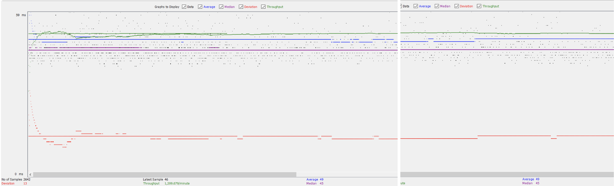
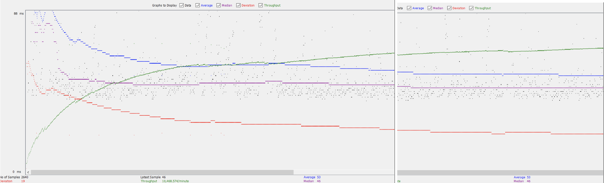

# General
  - #### Team: `the-party-parrots`
  - #### Names:
    - Colin Yee
    - Michelle Lin
  - #### Project 5 Video Demo Link:
    - https://youtu.be/HiRNnu2Y_xg
  - #### Collaborations and Work Distributions:
    - Servlets
      - MovieList (Colin, Michelle)
      - SingleMovie (Michelle)
      - SingleStar (Michelle)
      - Payment (Colin)
      - ShoppingCart (Michelle)
      - GenreServlet (Colin)
      - Jump (Michelle)
      - LoginFilter, Login (Michelle)
      - UpdateSecurePassword (Michelle)
      - BrowseGenre, BrowseTitle (Michelle)
      - RecaptchaConstraints, RecaptchaVerifyUtils (Michelle)
      - EmployeeLoginFilter, EmployeeLoginServlet (Michelle)
      - MovieSuggestion (Colin, Michelle)
    - Classes
      - Movie (Colin)
      - User (Michelle, Colin)
      - Employee (Michelle)
      - Actor (Michelle)
      - MovieObject (Colin)
      - StarInMovie (Michelle)
    - JS/HTML/CSS
      - `index` (Colin, Michelle)
      - `_dashboard` (Michelle)
      - `jump-movielist.js` (Michelle)
      - `login` (Michelle)
      - `movielist` (Michelle, Colin)
      - `payment` (Colin)
      - `navbar.css` (Michelle)
      - `shoppingcart` (Michelle, Colin)
      - `single-movie` (Michelle)
      - `single-star` (Michelle)
    - Parser
      - ActorParser (Michelle)
      - MovieParser (Colin)
      - CastParser2 (Michelle)
      - CastParser (Colin)
      - xmlParser (Colin, Michelle)
      - TimeLogParser (Michelle)
    - SQL Files
      - create_table.sql (Colin, Michelle)
      - full_text.sql (Michelle)
      - stored-procedure.sql (Michelle, Colin)
      - column_triggers.sql (Colin)
    - Files
      - .gitignore (Michelle)
      - pom.xml (Michelle)
      - context.xml (Michelle, Colin)
      - web.xml (Michelle, Colin)
    - Android
      - MovieListActivity, MovieListViewAdaptor, activity_movielist.xml (Colin)
      - SingleMovieListActivity, SingleMovieListViewAdaptor, activity_single_movie.xml, singlemovielist_row.xml (Colin)
      - urlConstants (Colin)
      - NukeSSLCerts, NetworkManager, LoginActivity, activity_login.xml (Michelle)
      - SearchActivity, activity_search.xml (Michelle)
      - AndroidManifest.xml (Michelle)
      - movielist_row.xml (Michelle, Colin)
    - Functionality
      - Add to Cart (Colin)
      - Proceed to Payment & Place Order (Colin)
      - Recaptcha (Colin)
      - HTTPS (Colin)
      - Parser Optimizations (Colin)
        - Batch Insertion
        - Multi-Threading
      - GET/POSTs (Michelle, Colin)
      - Advanced Jump Functionality (Michelle)
      - Search Autocomplete (Michelle)
      - Full Text Search (Colin)
      - Login In (Michelle)
      - Pagination, Sorting (Michelle)
    - Performance Tuning and Scaling
      - JDBC Connection Pooling (Colin)
      - Master-Slave Replication (Colin)
      - Load Balancer (Colin)
      - JMETER & Time Measurements (Michelle)

### Files that use PreparedStatements
- Almost all files in src (except User,Movie,MovieObject,Actor,RecaptchaConstraints,JumpServlet)
- most servlets already used prepared statements 
- changes: MovieListServlets (~line 135) changes to use PreparedStatements

### Parser Optimizations
1. Implemented Multi-Threading for MovieParser.
   - Use 3 threads to parse 3 batches of prepared statements at the same time. 
   - Reduced time of MovieParser to 1/3 its original time.
2. Implemented Batch Insertion in all Parsers.
   - Will create and execute prepared statements every 'x' objects. 
   - Reduced by time of all parsers to 1/(1.5) of their original times.
3. Implemented HashMap on CastParserV2.
   - Stores movies created in MovieParser in hashmap to be referenced by CastParser instead of calling db multiple times.
   - Reduces time of CastParserV2 by 1/2 its original time.
  
### Inconsistency Report
- located in movieLogs.txt, castLogs.txt, and actorLogs.txt in the /parseLogs/ file.

# Connection Pooling
  - #### Include the filename/path of all code/configuration files in GitHub of using JDBC Connection Pooling.
      * `\src\Browse\BrowseGenreServlet.java`
      * `\src\Browse\BrowseTitleServlet.java`
      * `\src\Browse\GenreServlet.java`
      * `\src\Employee\UpdateSecurePassword.java`
      * `\src\Login\UpdateSecurePassword.java`
      * `\src\Employee\DashboardServlet.java`
      * `\src\Employee\EmployeeLoginServlet.java`
      * `\src\Login\LoginServlet.java`
      * `\src\Parse\ActorParser.java`
      * `\src\Parse\CastParser2.java`
      * `\src\Parse\MovieParser.java`
      * `\src\Search\MovieSuggestion.java`
      * `\src\ShoppingCart\PaymentServlet.java`
      * `\src\ShoppingCart\ShoppingCartServlet.java`
      * `\src\WebPages\MovieListServlet.java`
      * `\src\WebPages\SingleMovieServlet.java`
      * `\src\WebPages\SingleStarServlet.java`
      - #### Explain how Connection Pooling is utilized in the Fabflix code.
          A Connection Pooling prevents us from opening and closing a database connection for every request. In Fabflix, the first request makes
          a connection to the database and future requests use the same connection. If the connection is being used, it would create a new connection.
          There is a limit to the number of connections (100)
      - #### Explain how Connection Pooling works with two backend SQL.
          Because there are two databases, there will be at most two connection pools.

- # Master/Slave
  - #### Include the filename/path of all code/configuration files in GitHub of routing queries to Master/Slave SQL.
    * `\src\Employee\DashboardServlet.java`
    * `\src\ShoppingCart\PaymentServlet.java`

- #### How read/write requests were routed to Master/Slave SQL?
    There are 3 database connections stated in `context.xml`:
    1. LocalHost Connection (on the instance)
    2. Master Connection (only to the master database)
    3. Slave Connection (only to the slave database)
    
    When there is a servlet that inserts or updates rows in the moviedb database, the servlet would create a Master Connection. If the servlet only reads from the databse, it would create a LocalHost Connection (which connects to either instance).

- # JMeter TS/TJ Time Logs
  - #### Instructions of how to use the `log_processing.*` script to process the JMeter logs.

- # JMeter TS/TJ Time Measurement Report

| **Single-instance Version Test Plan**          | **Graph Results Screenshot** | **Average Query Time(ms)** | **Average Search Servlet Time(ms)** | **Average JDBC Time(ms)** | **Analysis** |
|------------------------------------------------|-----------------------------|----------------------------|-------------------------------------|---------------------------|--------------|
| Case 1: HTTP/1 thread                          |    | 29ms                       | 3.53ms                              | 2.98ms                    | ??           |
| Case 2: HTTP/10 threads                        |   | 40ms                       | 11.11ms                             | 10.55ms                   | ??           |
| Case 3: HTTPS/10 threads                       |   | 40ms                       | 12.83ms                             | 12.21ms                   | ??           |
| Case 4: HTTP/10 threads/No connection pooling  |   | 43ms                       | 13.71ms                             | 13.10ms                   | ??           |

| **Scaled Version Test Plan**                   | **Graph Results Screenshot**        | **Average Query Time(ms)** | **Average Search Servlet Time(ms)** | **Average JDBC Time(ms)** | **Analysis** |
|------------------------------------------------|-------------------------------------|----------------------------|-------------------------------------|---------------------------|--------------|
| Case 1: HTTP/1 thread                          |         | 49ms                       | 3.5ms                               | 3.1ms                     | ??           |
| Case 2: HTTP/10 threads                        |       | 53ms                       | 9.4ms                               | 8.5ms                     | ??           |
| Case 3: HTTP/10 threads/No connection pooling  |  | 61ms                       | 6.2ms                               | 5.7ms                     | ??           |
